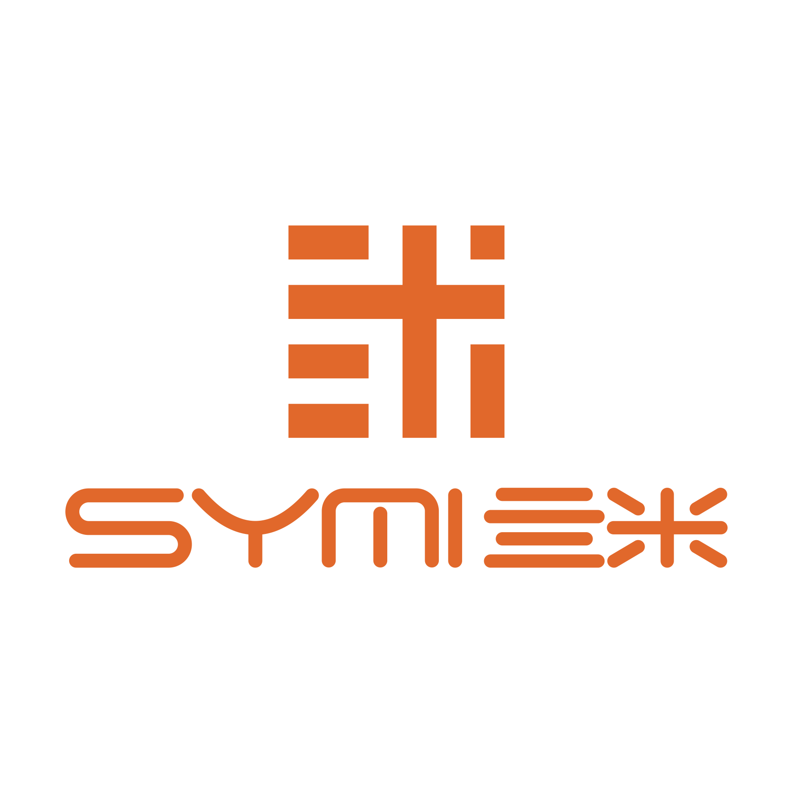

# HACS 官方提交指南



## 将 Home Assistant SYMI双向同步集成提交到 HACS 官方仓库

### 提交前检查清单

✅ **已完成的项目**：

- [x] 创建了符合 HACS 标准的 `hacs.json` 配置文件
- [x] 添加了详细的 `info.md` 文件
- [x] 完善了 `README.md` 文件，包含安装和使用说明
- [x] 验证了 `manifest.json` 文件符合 Home Assistant 标准
- [x] 添加了 SYMI 企业 logo 到适当位置
- [x] 创建了品牌目录结构 (`brands/symi/`)
- [x] 设置了正确的版本标签 (v2.0.1)
- [x] 代码已推送到 GitHub 仓库

### HACS 官方提交流程

#### 1. 访问 HACS 官方仓库

前往：https://github.com/hacs/default

#### 2. Fork 仓库

点击右上角的 "Fork" 按钮，将 HACS 默认仓库 fork 到您的 GitHub 账户。

#### 3. 克隆 Fork 的仓库

```bash
git clone https://github.com/YOUR_USERNAME/default.git
cd default
```

#### 4. 创建新分支

```bash
git checkout -b add-symi-two-way-sync
```

#### 5. 添加集成信息

编辑 `integrations.json` 文件，添加以下内容：

```json
{
  "symi-daguo/ha-two-way-sync": {
    "category": "integration",
    "description": "Home Assistant SYMI双向同步集成，支持两个实体之间的状态双向同步",
    "name": "Home Assistant SYMI双向同步",
    "render_readme": true
  }
}
```

#### 6. 提交更改

```bash
git add integrations.json
git commit -m "Add SYMI Two-Way Sync integration"
git push origin add-symi-two-way-sync
```

#### 7. 创建 Pull Request

1. 访问您 fork 的仓库页面
2. 点击 "Compare & pull request" 按钮
3. 填写 PR 标题：`Add SYMI Two-Way Sync integration`
4. 填写 PR 描述：

```markdown
## 添加 SYMI 双向同步集成

### 集成信息
- **名称**: Home Assistant SYMI双向同步
- **仓库**: https://github.com/symi-daguo/ha-two-way-sync
- **版本**: v2.0.1
- **类别**: 集成 (Integration)

### 功能特性
- 支持两个 Home Assistant 实体之间的状态双向同步
- 智能冲突检测和解决机制
- 支持多种实体类型（灯光、开关、传感器等）
- 健康检查和自动重连功能
- 完整的错误处理和日志记录

### HACS 合规性
- ✅ 包含 hacs.json 配置文件
- ✅ 包含 info.md 详细说明
- ✅ 完善的 README.md 文档
- ✅ 符合 manifest.json 标准
- ✅ 包含企业品牌标识
- ✅ 遵循 Home Assistant 开发规范

### 测试状态
- ✅ 代码编译通过
- ✅ 功能测试完成
- ✅ 错误处理验证
- ✅ 版本标签创建

### 联系信息
- **维护者**: SYMI团队
- **邮箱**: 303316404@qq.com
- **问题跟踪**: https://github.com/symi-daguo/ha-two-way-sync/issues
```

5. 点击 "Create pull request"

### 等待审核

HACS 团队会审核您的提交，这个过程可能需要几天到几周时间。审核期间可能会有以下要求：

1. **代码质量检查**
2. **文档完整性验证**
3. **安全性审查**
4. **功能测试**

### 审核标准

HACS 官方审核会检查：

- ✅ 代码质量和安全性
- ✅ 文档完整性
- ✅ 遵循 Home Assistant 开发规范
- ✅ 集成的实用性和稳定性
- ✅ 维护者的响应能力

### 替代方案：自定义仓库

如果官方审核时间较长，用户可以通过自定义仓库方式安装：

1. 在 HACS 中添加自定义仓库：`https://github.com/symi-daguo/ha-two-way-sync`
2. 选择类别："集成"
3. 直接安装使用

### 维护责任

一旦集成被 HACS 官方接受，需要承担以下维护责任：

1. **及时响应用户问题和 Issues**
2. **定期更新和修复 Bug**
3. **保持与 Home Assistant 新版本的兼容性**
4. **维护文档的准确性**

### 联系支持

如果在提交过程中遇到问题：

1. 查看 [HACS 文档](https://hacs.xyz/docs/publish/start)
2. 访问 [HACS Discord](https://discord.gg/apgchf8)
3. 提交 [GitHub Issue](https://github.com/hacs/integration/issues)

---

**准备状态**: ✅ 已就绪，可以提交到 HACS 官方仓库  
**版本**: v2.0.1  
**最后更新**: 2025年1月